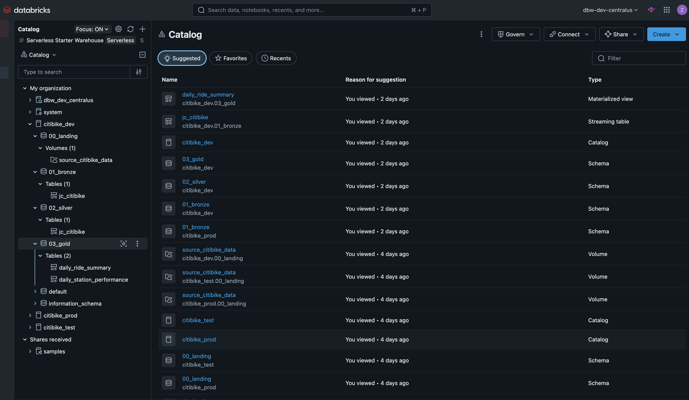
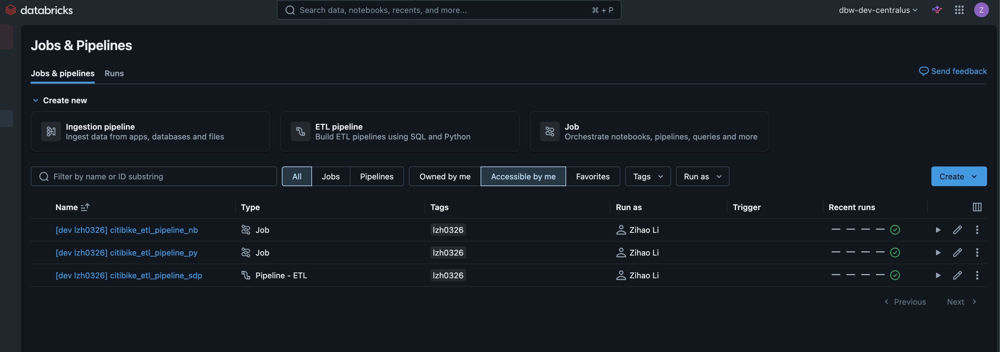
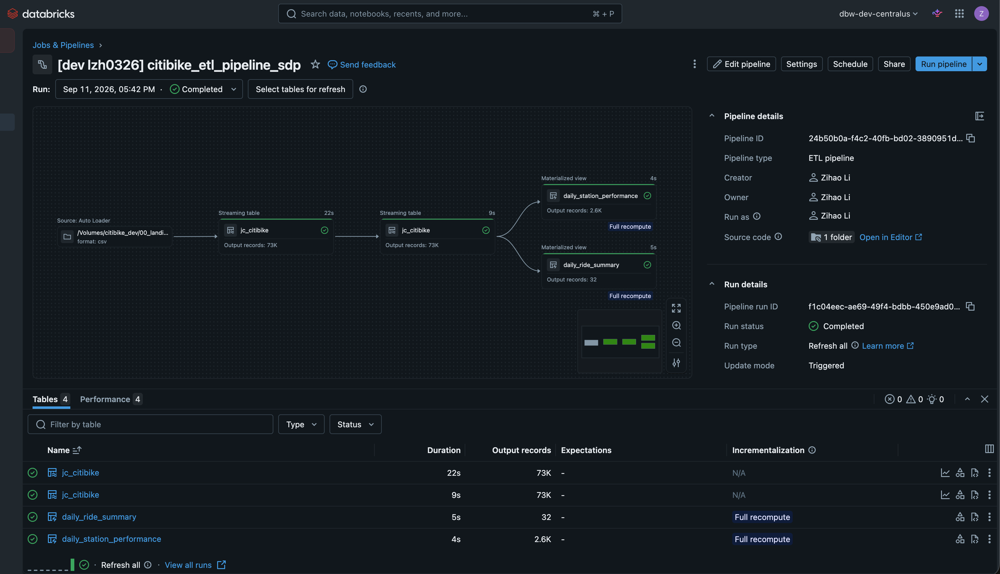

# Citibike ETL on Databricks

A medallion-architecture ETL project for Citi Bike trip data, built and deployed with
**Declarative Automation Bundles (DABs)** across three isolated Databricks workspaces.

The same pipeline is implemented **three different ways** — notebook tasks, Python script
tasks, and a declarative pipeline — so the trade-offs between the three Lakeflow authoring
styles can be compared side by side on identical data.

---

## Sample data

| | |
|---|---|
| **Source** | [Citi Bike System Data](https://citibikenyc.com/system-data) — publicly available trip records |
| **Dataset** | `JC-202503-citibike-tripdata.csv` — Jersey City stations, March 2025 (15.3 MB) |
| **Landing zone** | Unity Catalog Volume: `/Volumes/{catalog}/00_landing/source_citibike_data/` |
| **Grain** | One row per bike trip (~73K rows) |

Each row carries a ride id, rideable type, start/end timestamps, start/end station name and
id, start/end coordinates, and a member-vs-casual flag. The schema is declared explicitly
rather than inferred, so a change in the upstream file surfaces as an error instead of
silently shifting column types.

### Medallion layers

```
/Volumes/{catalog}/00_landing/source_citibike_data/    raw CSV dropped into a UC Volume
              │
              ▼
{catalog}.01_bronze.jc_citibike                        typed, unmodified + ingest metadata
              │
              ▼
{catalog}.02_silver.jc_citibike                        cleaned; + trip_duration_mins, trip_start_date
              │
              ├──▶ {catalog}.03_gold.daily_ride_summary          per-day min/max/avg duration, trip count
              └──▶ {catalog}.03_gold.daily_station_performance    per-day, per-station avg duration, trip count
```

Bronze stamps every row with a `metadata` map (`pipeline_id`, `run_id`, `task_id`,
`processed_date`) sourced from job runtime parameters, so any row can be traced back to the
run that produced it.



Unity Catalog after a completed run. Note the object types: bronze and silver are
**streaming tables**, while both gold tables are **materialized views** — the reasoning is
in the SDP section below.

---

## Three implementations of the same pipeline

| | Authoring style | Source | Deployed as | Compute |
|---|---|---|---|---|
| **1** | Notebooks | `citibike_etl/notebooks/` | Job `citibike_etl_pipeline_nb` (`notebook_task`) | Serverless |
| **2** | Python scripts | `citibike_etl/scripts/` | Job `citibike_etl_pipeline_py` (`spark_python_task`) | Serverless |
| **3** | Declarative (SDP) | `citibike_etl/sdp/` | Pipeline `citibike_etl_pipeline_sdp` | Serverless |



All three are deployed by a single `databricks bundle deploy`. The `[dev ...]` name prefix
and the tag are applied automatically by DAB's `development` mode, which keeps concurrent
deployments from different developers isolated from one another.

### 1 & 2 — Imperative jobs

Both express the same four tasks with an explicit dependency graph
(`bronze → silver → {gold_summary, gold_station}`), the two gold tasks running in parallel.
Runtime context is injected through task parameters:

```yaml
parameters:
  - "{{job.id}}"
  - "{{job.name}}"
  - "{{task.run_id}}"
  - "{{job.start_time.iso_datetime}}"
  - ${var.catalog}
```

The notebook variant reads the same values via `base_parameters` and `dbutils.widgets`.
Notebooks are convenient to develop interactively; plain `.py` files diff and review far
better in git — hence keeping both.

### 3 — Declarative pipeline (SDP)

The declarative variant is not a port of the imperative logic; it is the same *intent*
expressed so the platform handles incrementality:

- **Bronze** is a streaming table fed by **Auto Loader** (`cloudFiles`), pointed at the
  *directory* rather than a single file — dropping `JC-202504-*.csv` in later picks it up
  without reprocessing history.
- **Silver** streams from bronze, so only new rows flow through.
- **Gold** tables are **materialized views** with batch reads. Streaming tables are
  append-only and would not recompute an aggregate when upstream rows change; a
  materialized view does.
- Layer schemas are passed in through pipeline `configuration` and read with
  `spark.conf.get()`, keeping the code free of hardcoded catalog or schema names.



A completed run over the March 2025 file: 73K trip records flow through bronze (22s) and
silver (9s), producing 32 daily buckets in `daily_ride_summary` and 2.6K rows in
`daily_station_performance` (day × station). The dependency graph, the
per-table record counts, and the incrementalisation strategy shown for each table are all
derived by the platform; none of it is declared in the pipeline code.

> **Note:** all three implementations write to the *same* target tables. Run them against
> separate catalogs (or one at a time), since a Delta table written by a job and a streaming
> table / materialized view managed by a pipeline cannot occupy the same name.

---

## Shared code, packaged as a wheel

Transformation helpers live in `src/` and are consumed by jobs, pipelines, and tests alike.
They ship as a wheel rather than being imported by relative path:

```toml
# pyproject.toml
[tool.hatch.build.targets.wheel]
packages = ["src/citibike", "src/utils"]
```

```yaml
# databricks.yml — built automatically on every deploy
artifacts:
  python_artifact:
    type: whl
    build: uv build --wheel
```

```yaml
# resources/*.job.yml — installed into the serverless environment
environments:
  - environment_key: Default
    spec:
      environment_version: "5"
      dependencies:
        - ../dist/*.whl
```

`databricks bundle deploy` builds the wheel, uploads it, and each run `pip install`s it — so
tasks simply `from citibike.citibike_utils import get_trip_duration_mins` with no
`sys.path` manipulation and no divergence between local and deployed import semantics.

---

## Testing

`pytest` with **Databricks Connect**: tests are written locally and run against real
Databricks compute, so they exercise the same Spark version and Unity Catalog semantics as
production.

```bash
uv run pytest                                    # all tests
uv run pytest --cov=src --cov-report=term-missing # with coverage
```

`tests/conftest.py` supplies a single `spark` fixture that degrades gracefully:
`databricks.connect.DatabricksSession` when Databricks Connect is installed (local
development, real serverless compute), otherwise a plain local `SparkSession`
(`local[*]`). That fallback is what lets the identical test suite run unchanged in CI,
where no workspace credentials are available — see [CI / CD](#ci--cd) below.

`fixtures/` is currently empty — scaffolding kept in place for tests that need a fixed
input data set rather than inline literals. The existing tests construct their DataFrames
inline, which keeps the expected values visible right next to the assertions.

Coverage is scoped to `src/` via `.coveragerc`. Tests target the transformation helpers —
pure DataFrame logic with deterministic inputs and expected outputs — rather than asserting
against live table contents.

---

## Multi-environment deployment

Three targets, each a separate workspace with its own catalog:

| Target | Mode | Catalog | Schema | Notes |
|---|---|---|---|---|
| `dev` | `development` | `citibike_dev` | deployer's short name | Default target; resources prefixed and schedules paused |
| `test` | `production` | `citibike_test` | deployer's short name | Deployed under `/Workspace/Shared`, prefixed `[test]` |
| `prod` | `production` | `citibike_prod` | `prod` | Single shared copy, prefixed `[prod]` |

```bash
databricks bundle validate --strict -t dev
databricks bundle deploy -t dev
databricks bundle run citibike_etl_pipeline_py -t dev
```

The catalog is a bundle variable (`${var.catalog}`) rather than a literal, so the identical
code artifact is promoted dev → test → prod with no source changes. Permissions are granted
to `${workspace.current_user.userName}`, meaning whoever deploys gets management rights
without an email hardcoded in the repo.

---

## CI / CD

Two GitHub Actions workflows cover the path from a commit on `dev` to a deployed bundle in
production.

| Workflow | File | Trigger | Does |
|---|---|---|---|
| **CI** | `.github/workflows/ci-workflow.yml` | push to `dev`, PR into `main` | Install, run `pytest` with coverage, upload HTML report |
| **CD** | `.github/workflows/cd-workflow.yml` | push to `main` | `bundle deploy` to `test`, then to `prod` |

```
 commit on dev ──▶ CI (pytest + coverage)
       │
       ▼
 PR into main ───▶ CI (pytest + coverage)   ← merge gate
       │
       ▼
 push to main ───▶ CD ──▶ deploy test ──▶ deploy prod
```

### CI — test and coverage

The CI job runs on `ubuntu-latest` with Python 3.12 and installs
`requirements-pyspark.txt` — a pinned, **Databricks Connect-free** set that includes
`pyspark` itself. Because no `databricks.connect` is present, the `spark` fixture falls
back to a local `SparkSession`, so the suite executes entirely inside the runner: no
workspace, no credentials, no compute cost, and nothing to leak from a fork's pull
request.

```yaml
- name: Run pytest & generate HTML report
  run: |
    pytest \
      --disable-warnings \
      --cov=./src \
      --cov-report=html
```

The `htmlcov/` output is uploaded as a `coverage-html` build artifact, so coverage for a
given run can be browsed from the Actions page rather than being read out of log text.

### CD — promote to test, then prod

The CD workflow is two sequential jobs; `cd-deploy-prod` declares `needs: cd-deploy-test`,
so production is only touched after the test workspace deploy has succeeded. Each job is
bound to a GitHub **Environment** (`test` / `prod`), which is where the workspace secrets
live and where a required-reviewer rule can be attached if a manual approval gate before
prod is wanted.

Each job installs the Databricks CLI, writes a `~/.databrickscfg` profile, and deploys the
bundle target of the same name:

```yaml
- name: Configure Databricks
  run: |
    cat <<EOF > ~/.databrickscfg
    [TEST]
    host = https://adb-....azuredatabricks.net
    azure_tenant_id = ${{ secrets.AZURE_TENANT_ID }}
    azure_client_id = ${{ secrets.AZURE_CLIENT_ID }}
    azure_client_secret = ${{ secrets.AZURE_CLIENT_SECRET }}
    EOF

- name: Deploy to TEST
  run: databricks bundle deploy --target test --profile TEST
```

Authentication is an **Azure service principal** (M2M OAuth) rather than a personal access
token, so deployments are not tied to an individual user account. The three values come
from the environment's secrets:

| Secret | Purpose |
|---|---|
| `AZURE_TENANT_ID` | Entra ID tenant of the workspace |
| `AZURE_CLIENT_ID` | Service principal application id |
| `AZURE_CLIENT_SECRET` | Service principal secret |

Both target workspaces share the same secret *names*, each environment supplying its own
values — promoting a change from test to prod therefore requires no edit to the workflow
or to the bundle source.

`databricks bundle deploy` builds the wheel as part of the deploy (the `artifacts` block
in `databricks.yml`), so the CD job needs no separate build step beyond `setuptools` and
`wheel`.

> The service principal must have workspace access plus `USE CATALOG` / `CREATE` rights on
> `citibike_test` and `citibike_prod`, and be able to create jobs and pipelines. Bundle
> permissions in `databricks.yml` are granted to
> `${workspace.current_user.userName}` — under CD that resolves to the service principal,
> not to a human deployer.

---

## Local development

Dependencies are managed with [uv](https://docs.astral.sh/uv/):

```bash
uv sync --dev          # create .venv and install locked dependencies
uv run pytest          # run tests without activating anything
```

`pyproject.toml` carries a `[tool.uv] constraint-dependencies` block generated by
`databricks environments setup-local`, pinning local package versions to those present in
**serverless environment version 5**. Local runs therefore resolve the same dependency
versions as deployed runs, which is why `uv sync` may *downgrade* packages — that is the
intended behaviour, not a conflict.

---

## Project structure

```
├── .github/workflows/
│   ├── ci-workflow.yml             pytest + coverage on dev / PRs to main
│   └── cd-workflow.yml             bundle deploy to test, then prod
├── databricks.yml                 bundle definition, targets, wheel artifact
├── resources/
│   ├── citibike_etl_pipeline_nb.job.yml       notebook-task job
│   ├── citibike_etl_pipeline_py.job.yml       python-script-task job
│   └── citibike_etl_pipeline_sdp.pipeline.yml declarative pipeline
├── citibike_etl/
│   ├── notebooks/{01_bronze,02_silver,03_gold}/   implementation 1
│   ├── scripts/{01_bronze,02_silver,03_gold}/     implementation 2
│   └── sdp/{01_bronze,02_silver,03_gold}/         implementation 3
├── src/
│   ├── citibike/citibike_utils.py     trip duration
│   └── utils/datetime_utils.py        timestamp → date
├── tests/
│   ├── conftest.py                    spark / load_fixture fixtures
│   ├── test_citibike_utils.py
│   └── test_datetime_utils.py
├── fixtures/                      (reserved) input data sets for load_fixture
└── pyproject.toml                 package metadata, wheel build, uv constraints
```

---

## Notable implementation details

- **Explicit schemas everywhere** — no `inferSchema`. Auto Loader additionally declares
  `_rescued_data`, so values that fail to parse are captured rather than dropped.
- **Serverless throughout**, with `performance_target: PERFORMANCE_OPTIMIZED` on the jobs.
- **Streaming vs. batch chosen per dataset**, not globally: streaming tables where the
  source grows, materialized views where an aggregate must be recomputed.
- **Idempotent gold layer** — aggregates are derived, so re-running yields the same result.
- **`ruff`** for linting and formatting, configured at 120 columns.
